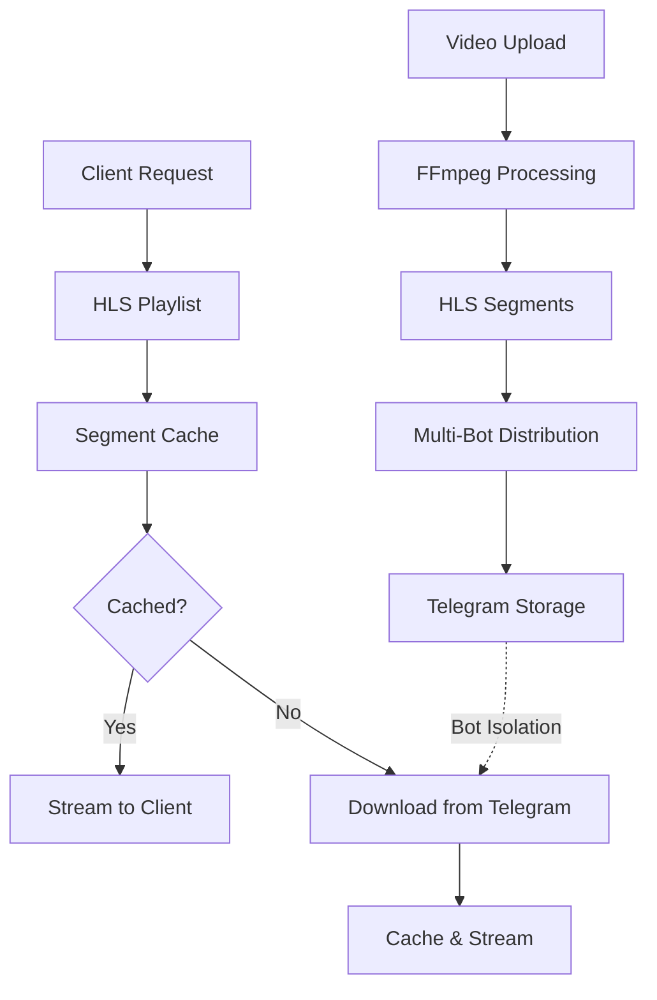

# Telegram HLS Streamer 📺

**Turn Telegram into your unlimited personal Netflix!**

A sophisticated video streaming server that uses Telegram bots as unlimited cloud storage. Upload any video, and it gets automatically converted to HLS format, split into segments, distributed across multiple Telegram bots, and served as a smooth streaming experience with features like hardware acceleration, predictive caching, and multi-language support.

[](https://www.python.org/)
[](LICENSE)
[](https://developer.apple.com/streaming/)

## 🎯 What This Does (In Simple Terms)

1. **Upload a video** → Gets chopped into small pieces (segments)
2. **Pieces stored in Telegram** → Using multiple bots for unlimited storage
3. **Stream anywhere** → Like Netflix, but with your own videos
4. **Smart caching** → Predicts what you'll watch next and pre-downloads it
5. **Hardware acceleration** → Uses your GPU to process videos super fast
6. **Multi-language support** → Handles subtitles and multiple audio tracks perfectly

## 🏗️ Architecture Overview



### Core Components

- **🎬 Video Processor**: Converts videos to HLS using FFmpeg with hardware acceleration
- **🤖 Telegram Handler**: Distributes segments across multiple bots using round-robin
- **📊 Database**: SQLite database tracking all videos, segments, and metadata
- **🌐 Web Server**: aiohttp-based API and UI for managing your streaming server
- **💾 Smart Cache**: Predictive caching that learns your viewing patterns
- **📱 Web Interface**: Modern single-page application for easy management

## 📁 Project Structure Explained

```
telegram-hls-streamer/
├── 🎯 main_refactored.py          # Main entry point - start here!
├── ⚙️ requirements.txt            # Python dependencies
├── 📝 .env                        # Configuration file (you'll create this)
├── 
├── 🗄️ DATABASE & STORAGE
├── video_streaming.db             # SQLite database (auto-created)
├── segments/                      # Temporary storage during processing
├── playlists/                     # HLS playlist files
│   ├── local/                     # Local playlists (relative URLs)
│   └── public/                    # Public playlists (full URLs)
├── cache/                         # Downloaded segment cache
├── temp_uploads/                  # Temporary upload storage
│
├── 🎨 FRONTEND
├── templates/                     # Web interface templates
│   ├── index.html                # Main dashboard
│   ├── upload.html              # Video upload page
│   ├── playlists.html           # Video library
│   ├── player.html              # Video player
│   ├── settings.html            # Configuration
│   └── logs.html                # System monitoring
├── static/                       # CSS, JS, and assets
│   ├── styles.css               # Main stylesheet
│   └── app.js                   # Frontend JavaScript
│
├── 🧠 CORE APPLICATION
├── src/
│   ├── 🏢 core/                  # Application orchestration
│   │   ├── app.py               # Main application class
│   │   ├── config.py            # Configuration management
│   │   └── exceptions.py        # Custom error types
│   │
│   ├── 🛠️ services/             # Business logic layer
│   │   ├── interfaces/          # Service contracts (what each service does)
│   │   │   ├── playlist.py      # HLS playlist operations
│   │   │   ├── storage.py       # Database operations  
│   │   │   ├── telegram.py      # Bot communication
│   │   │   └── video_processing.py # Video conversion
│   │   │
│   │   ├── implementations/     # Service implementations (how it's done)
│   │   │   ├── playlist.py      # Generates HLS playlists
│   │   │   ├── storage.py       # SQLite database operations
│   │   │   ├── telegram.py      # Multi-bot Telegram handler
│   │   │   └── video_processing.py # FFmpeg video processing
│   │   │
│   │   └── registry.py          # Service dependency injection
│   │
│   ├── 🎬 processing/           # Video processing engine
│   │   ├── video_processor.py   # Main FFmpeg orchestrator
│   │   ├── hardware_accel.py    # GPU acceleration detection
│   │   ├── ffmpeg_pool.py       # Process pool management
│   │   ├── cache_manager.py     # Predictive caching system
│   │   ├── segment_optimizer.py # HLS segment optimization
│   │   └── batch_processor.py   # Multi-video processing
│   │
│   ├── 🤖 telegram/             # Telegram bot integration
│   │   └── handler.py           # Round-robin multi-bot handler
│   │
│   ├── 🗄️ storage/             # Database management
│   │   └── database.py          # SQLite operations and schema
│   │
│   ├── 🌐 web/                 # Web server and API
│   │   ├── server.py           # aiohttp server setup
│   │   ├── routes.py           # URL routing
│   │   └── handlers/           # Request handlers
│   │       ├── api_handlers.py              # REST API endpoints
│   │       ├── content_handlers_service.py  # Service-layer streaming handlers
│   │       ├── ui_handlers.py               # Web interface
│   │       └── video_upload_handler.py      # Video upload processing
│   │
│   └── 🔧 utils/               # Utilities and helpers
│       ├── logging.py          # Centralized logging
│       ├── file_utils.py       # File operations
│       └── networking.py       # Network utilities
│
├── 📚 DOCUMENTATION
├── README.md                   # This file!
├── CLAUDE.md                   # Developer instructions
├── DATABASE_SCHEMA.md          # Database documentation
└── 📋 LOG FILES
    ├── log.txt                # Main application log
    ├── upload_log.txt         # Video upload tracking
    └── playback_log.txt       # Streaming analytics
```

## 🚀 Quick Start Guide (For Complete Beginners)

### Prerequisites

1. **Python 3.8 or higher**
   ```bash
   # Check if you have Python
   python3 --version
   
   # If not installed, download from https://python.org
   ```

2. **FFmpeg** (for video processing)
   ```bash
   # Ubuntu/Debian
   sudo apt install ffmpeg
   
   # macOS (with Homebrew)
   brew install ffmpeg
   
   # Windows - download from https://ffmpeg.org/download.html
   ```

3. **Telegram Bot Tokens** (see setup below)

### Step 1: Download the Project

```bash
# Clone the repository (if using git)
git clone <repository-url>
cd telegram-hls-streamer

# OR download and extract the ZIP file, then navigate to the folder
```

### Step 2: Set Up Python Environment

```bash
# Create a virtual environment (keeps dependencies separate)
python3 -m venv venv

# Activate the virtual environment
# On Linux/Mac:
source venv/bin/activate
# On Windows:
venv\Scripts\activate

# Install required packages
pip install -r requirements.txt
```

### Step 3: Create Telegram Bots

**Why multiple bots?** Each bot can handle 20MB files, so multiple bots = more storage and faster uploads!

1. **Talk to BotFather on Telegram**:
   - Open Telegram and search for `@BotFather`
   - Send `/start` then `/newbot`
   - Give your bot a name and username
   - **Save the token** - you'll need it!

2. **Repeat for more bots** (recommended: 3-5 bots):
   - Each bot needs a unique name and username
   - Save all tokens

3. **Create a private channel**:
   - Create a new private channel in Telegram
   - Add all your bots as administrators
   - Get the channel ID (usually starts with `-100`)

### Step 4: Configure the Application

Create a `.env` file in the project root:

```bash
# Copy the example configuration
cp .env.example .env
```

Edit the `.env` file with your settings:

```bash
# Basic Configuration
LOCAL_HOST=0.0.0.0
LOCAL_PORT=8080
PUBLIC_DOMAIN=your-domain.com          # Optional: for external access
FORCE_HTTPS=false                      # Set to true if using SSL

# Telegram Bots (add as many as you have)
BOT_TOKEN=your_first_bot_token_here
CHAT_ID=your_private_channel_id_here

BOT_TOKEN_1=your_second_bot_token_here
CHAT_ID_1=your_private_channel_id_here

BOT_TOKEN_2=your_third_bot_token_here  
CHAT_ID_2=your_private_channel_id_here

# Optional: Hardware Acceleration (auto-detects by default)
FFMPEG_HARDWARE_ACCEL=auto            # auto/nvenc/vaapi/qsv

# Optional: Processing Settings
FFMPEG_THREADS=4                      # Adjust based on your CPU
CACHE_SIZE=1073741824                 # 1GB cache (in bytes)
PRELOAD_SEGMENTS=8                    # Pre-download this many segments

# Optional: File Limits
MAX_UPLOAD_SIZE=53687091200          # 50GB max video size
```

### Step 5: Start the Server

```bash
# Make sure your virtual environment is activated
source venv/bin/activate  # Linux/Mac
# or
venv\Scripts\activate     # Windows

# Test your Telegram bots first
python main_refactored.py test-bots

# If bots are working, start the server
python main_refactored.py serve
```

### Step 6: Access the Web Interface

Open your browser and go to:
- **Local**: `http://localhost:8080`
- **Network**: `http://your-ip:8080` (replace with your computer's IP)

You should see the dashboard with:
- 📤 **Upload**: Upload videos
- 📺 **Playlists**: View your video library  
- ⚙️ **Settings**: Configure the system
- 📊 **Logs**: Monitor system health

## 🎬 How to Use

### Uploading Videos

1. **Go to the Upload tab**
2. **Select your video file** (supports most formats: MP4, MKV, AVI, etc.)
3. **Click Upload** and wait for processing
4. **Processing steps you'll see**:
   - File analysis (codec, resolution, languages)
   - Video segmentation (chopping into small pieces)
   - Telegram upload (distributing across your bots)
   - Playlist generation (creating streaming files)

### Watching Videos

1. **Go to the Playlists tab**
2. **Click on any video** to open the player
3. **Features available**:
   - Multiple audio tracks (if available)
   - Subtitles (if available)
   - Quality selection
   - Seeking and playback controls

### Monitoring the System

1. **Settings tab**: View configuration and system stats
2. **Logs tab**: Monitor uploads, streaming, and errors
3. **Dashboard**: Overview of storage usage and active streams

## 🔧 Configuration Deep Dive

### Network Settings

```bash
# Basic local setup
LOCAL_HOST=0.0.0.0        # Listen on all interfaces
LOCAL_PORT=8080           # Web server port

# Public access setup
PUBLIC_DOMAIN=stream.mydomain.com
FORCE_HTTPS=true
SSL_CERT_PATH=/path/to/cert.pem
SSL_KEY_PATH=/path/to/key.pem
```

### Video Processing Settings

```bash
# Hardware acceleration (speeds up processing significantly)
FFMPEG_HARDWARE_ACCEL=auto    # Let system choose best option
# Options: auto, nvenc (NVIDIA), vaapi (Intel), qsv (Intel), none

# Processing resources
FFMPEG_THREADS=4              # CPU threads to use
ENABLE_TWO_PASS_ENCODING=true # Better quality, slower processing

# Segment settings
MIN_SEGMENT_DURATION=2        # Minimum segment length (seconds)
MAX_SEGMENT_DURATION=30       # Maximum segment length (seconds)
```

### Caching Settings

```bash
# Cache type and size
CACHE_TYPE=memory            # or 'disk' for slower but persistent cache
CACHE_SIZE=1073741824        # 1GB in bytes

# Predictive caching (pre-downloads segments you'll likely watch)
PRELOAD_SEGMENTS=8           # Number of segments to pre-download
MAX_CONCURRENT_PRELOADS=5    # Parallel downloads for preloading
```

### Multi-Bot Configuration

```bash
# You can configure up to 10 bots (BOT_TOKEN_1 through BOT_TOKEN_10)
# More bots = more storage capacity and faster uploads

BOT_TOKEN_1=bot1_token_here
CHAT_ID_1=channel_id_here

BOT_TOKEN_2=bot2_token_here  
CHAT_ID_2=channel_id_here

# The system automatically distributes files across all configured bots
```

## 🤔 How It Works (Technical Details)

### Video Processing Pipeline

```
1. Upload → temp_uploads/video.mp4
2. Analysis → Extract metadata (resolution, codecs, languages)
3. Processing → FFmpeg converts to HLS segments
   ├── Video segments: video_000.ts, video_001.ts, ...
   ├── Audio segments: audio_000.ts, audio_001.ts, ... (per language)
   └── Subtitle segments: subtitle_000.vtt, ... (per language/track)
4. Upload → Round-robin distribution across Telegram bots
5. Database → Store segment metadata with bot_id tracking
6. Playlists → Generate HLS master and track playlists
7. Cleanup → Delete local segments (Telegram is now the source)
```

### Streaming Architecture

```
Client Request → HLS Playlist → Segment Requests → Smart Cache Check
                                      ↓
                              Cache Miss → Telegram Download
                                      ↓
                              Cache Store → Stream to Client
```

### Bot Isolation System

**Critical Security Feature**: Each segment can ONLY be downloaded by the bot that uploaded it.

- **Upload**: File hash determines which bot uploads the segment
- **Storage**: Database stores both `file_id` and `bot_id` for each segment  
- **Download**: System uses the exact bot that uploaded the segment
- **No Fallbacks**: If a bot is unavailable, its segments can't be accessed (prevents unauthorized access)

### Database Schema

The SQLite database tracks:
- **Videos**: Metadata, processing status, codecs, resolution
- **Segments**: Individual HLS segments with bot tracking
- **Subtitles**: Language tracks and metadata
- **Cache**: Access patterns for optimization

## 🔍 Troubleshooting

### Common Issues

**"Bot token invalid" Error**
```bash
# Test your bots individually
python main_refactored.py test-bots

# Check .env file format - no quotes around values:
BOT_TOKEN=123456:ABC-DEF...  # ✅ Correct
BOT_TOKEN="123456:ABC-DEF..."  # ❌ Wrong (remove quotes)
```

**"FFmpeg not found" Error**
```bash
# Check if FFmpeg is installed
ffmpeg -version

# If not found, install it:
# Ubuntu/Debian: sudo apt install ffmpeg
# macOS: brew install ffmpeg
# Windows: Download from https://ffmpeg.org/download.html
```

**Videos won't play**
```bash
# Check the logs
python main_refactored.py serve
# Then check: http://localhost:8080/#/logs

# Common causes:
# 1. Bots don't have access to the channel
# 2. Channel ID is wrong (should start with -100)
# 3. Network connectivity issues
```

**Slow processing**
```bash
# Enable hardware acceleration in .env:
FFMPEG_HARDWARE_ACCEL=auto

# Increase threads (match your CPU cores):
FFMPEG_THREADS=8

# Check hardware acceleration is working in logs
```

**High memory usage**
```bash
# Reduce cache size:
CACHE_SIZE=536870912  # 512MB instead of 1GB

# Use disk cache instead of memory:
CACHE_TYPE=disk
```

### Getting Help

1. **Check the logs**:
   - Web interface: Go to Logs tab
   - File: `log.txt` in project directory

2. **Test components individually**:
   ```bash
   python main_refactored.py test-bots    # Test Telegram connectivity
   python main_refactored.py config       # Show current configuration
   ```

3. **Common log patterns**:
   - `Bot isolation enforced`: Normal - shows security is working
   - `Hardware acceleration detected`: Good - GPU is being used
   - `Cache hit ratio`: Shows caching effectiveness
   - `Segment download failed`: Check bot permissions

## 🛡️ Security & Privacy

- **Local Operation**: Everything runs on your own server/computer
- **No External Dependencies**: Only connects to Telegram (which you control)
- **Bot Isolation**: Strict security prevents unauthorized access between bots
- **Private Channels**: Your videos are stored in your private Telegram channels
- **No Telemetry**: No usage data is sent anywhere

## 📈 Performance Optimization

### Hardware Acceleration
- **NVIDIA GPUs**: Uses NVENC encoder (much faster than CPU)
- **Intel Graphics**: Uses VAAPI or QSV encoders  
- **Apple Silicon**: Uses VideoToolbox encoder
- **Auto-Detection**: Automatically picks the best available option

### Caching Strategy
- **Predictive Cache**: Learns your viewing patterns
- **Segment Preloading**: Downloads segments before you need them
- **Access Tracking**: Prioritizes frequently accessed content
- **Memory vs Disk**: Choose based on your system resources

### Multi-Bot Benefits
- **Parallel Uploads**: Multiple bots upload simultaneously
- **Load Distribution**: Spreads storage across bot limits
- **Redundancy**: If one bot fails, others continue working
- **Capacity Scaling**: Each bot adds ~20MB per file capacity

## 🚀 Advanced Usage

### Public Access Setup

To access from anywhere on the internet:

1. **Domain Setup**:
   ```bash
   PUBLIC_DOMAIN=stream.yourdomain.com
   FORCE_HTTPS=true
   ```

2. **Reverse Proxy** (recommended - use nginx):
   ```nginx
   server {
       server_name stream.yourdomain.com;
       location / {
           proxy_pass http://localhost:8080;
           proxy_set_header Host $host;
           proxy_set_header X-Real-IP $remote_addr;
       }
   }
   ```

### Batch Processing

Process multiple videos at once:

```python
# Use the batch processor API
POST /api/batch-process
Content-Type: application/json

{
    "video_paths": [
        "/path/to/video1.mp4",
        "/path/to/video2.mkv"
    ],
    "concurrent_limit": 2
}
```

### API Integration

The system provides a full REST API:

- `GET /api/videos` - List all videos
- `POST /process` - Upload and process video
- `GET /api/status/{task_id}` - Check processing status
- `GET /master/{video_id}.m3u8` - Get HLS playlist
- `GET /segments/{video_id}/{track}/{segment}` - Stream segment

## 📋 System Requirements

### Minimum Requirements
- **CPU**: 2 cores, 2GHz
- **RAM**: 4GB
- **Storage**: 10GB free space (for temporary processing)
- **Network**: Stable internet connection
- **Python**: 3.8 or higher

### Recommended Requirements
- **CPU**: 4+ cores, modern processor
- **RAM**: 8GB+ (more for better caching)
- **Storage**: 50GB+ free space
- **GPU**: NVIDIA/Intel/Apple GPU for hardware acceleration
- **Network**: Fast internet for Telegram uploads

### Supported Platforms
- **Linux**: Ubuntu 18.04+, Debian 10+, CentOS 7+
- **macOS**: 10.15+ (Catalina or newer)
- **Windows**: Windows 10/11 with Python 3.8+
- **Docker**: Official image available (see Docker section)

## 🤝 Contributing

This project follows clean architecture principles:

- **Service Layer**: Business logic separated from implementation
- **Interface Contracts**: Clear APIs between components
- **Dependency Injection**: Configurable and testable
- **Error Handling**: Structured exceptions with proper logging

See `CLAUDE.md` for detailed development guidelines.

## 📜 License

MIT License - feel free to use for personal or commercial projects.

## 🙏 Acknowledgments

- **FFmpeg**: The backbone of video processing
- **Telegram**: Unlimited cloud storage platform
- **aiohttp**: High-performance async web framework
- **Python**: The glue that holds it all together

---

**Built with ❤️ for the self-hosting community**

*Transform Telegram into your personal streaming empire! 🎬*
